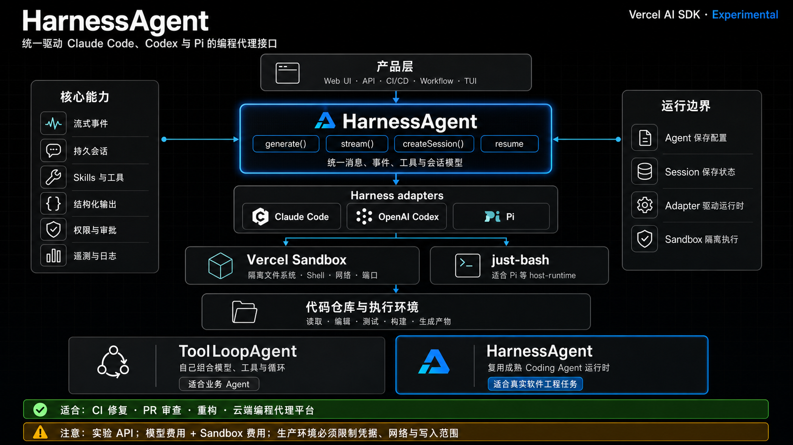

# Dynamic Agent Runtime

Coding Agent SDK、Agent Skills 与 Vercel AI SDK HarnessAgent 的可核验资料库，并包含可运行的 Luna 聊天机器人。

## Luna Harness Chat

App 使用 `HarnessAgent` + Pi adapter + `just-bash` 隔离 sandbox，通过 CPA 调用 `gpt-5.6-luna`：

- Thinking：`max`
- CPA tier：`fast`（`X-Claudex-Speed: fast`）
- Session：Harness 原生多轮状态；浏览器历史保存在 `localStorage`
- Credential：只在服务端解析，不写入 Git 或浏览器
- Source：公开 GitHub 仓库
- Harness：页面点击切换 Pi / Cline；两者保持独立原生 session
- Evolution：主动 schema 更新与被动 feedback 迭代 playbook
- Runtime：仅部署在 `macmini`
- Access：通过 Tailscale Serve 从本机私密访问

## Deployment boundary

**NEVER deploy this application on the MacBook.** `npm start` 有硬性 tailnet 身份检查，仅允许 `macmini.tail6a877d.ts.net`。本机只允许短时开发、构建和测试。

部署后地址：

```text
https://macmini.tail6a877d.ts.net:3012
```

双击 `~/Desktop/Luna Harness Chat.app` 只会打开远端 tailnet URL，不会在本机启动服务。完整规则与恢复流程见 [Mac mini deployment](docs/deployment.md)。

[](docs/vercel-harness-agent.md)

架构图展示产品层、`HarnessAgent`、runtime adapters、sandbox 与代码执行环境之间的关系。点击图片阅读完整指南。

## 文档

- [Coding Agent SDK 全景](docs/coding-agent-sdk-landscape.md)
- [后端 Agent Runtime 全量清单](docs/backend-agent-runtimes.md)
- [Vercel AI SDK HarnessAgent 指南](docs/vercel-harness-agent.md)
- [本体与专家进化](docs/ontology-evolution.md)
- [Mac mini 部署与恢复](docs/deployment.md)

## 收录原则

只收录以下来源：

1. 厂商官方 SDK、API、文档或仓库。
2. 高采用、持续维护的开源项目。
3. 有明确维护者、许可、版本状态和安全边界的项目。

不收录来源不明、低采用的非官方包装器。归档项目和未承诺兼容性的内部 API 只记录，不推荐。

## 数据时间

资料快照：2026-08-31。

GitHub stars 只表示采用度，不代表质量。功能与版本状态以各项目官方文档为准。
